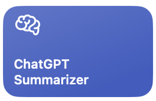

# ChatGPT Summarizer Apple Shortcut ⚡️ 📲💻

This repository contains the code and documentation to setup a self-hosted proxy that lets you with **one tap** summarize webpages from your Apple devices. Use it for

* Articles and Blog Posts
* Github READMEs
* HN comments

It's entirely self-hosted: the Shortcut runs directly on your device, and the proxy is deployed directly onto a serverless hosting platform, such as 
[Digital Ocean App Platform](https://www.digitalocean.com/products/app-platform) or [Heroku](https://www.heroku.com/).

## Usage

The app uses the excellent [FastAPI](https://github.com/tiangolo/fastapi) to provide a small endpoint that accepts a URL, 
uses [BeautifulSoup](https://www.crummy.com/software/BeautifulSoup/bs4/doc/) to extract text from the webpage, and sends
that to OpenAI's [ChatCompletions](https://platform.openai.com/docs/guides/chat) service to create a succinct summary.

E.g. let's say that you have deployed this repo as an app available at `https://summaries.app.dev`, you would send requests that look like


```
POST https://summaries.app.dev/summarize

Content-Type: application/json

{
  "url": "https://github.com/stallionlabs/summarizer-app/blob/main/README.md"
}
```

The response will be string containing the summary, that's it!

## Deployment

> We provide one-click Digital Ocean App Engine deploys, but you can use any app host you like!

If you have a Digital Ocean account, you can click the big blue button to easily deploy this and get to self-hosting! If you go for the Basic plan it will cost you $5/month to run it.

[](https://cloud.digitalocean.com/apps/new?repo=https://github.com/stallionlabs/summarizer-app/tree/main)


## Shortcut Setup

The Shortcut is [publicly accessible via iCloud](https://www.icloud.com/shortcuts/edd2f4b6ff5a4580a7239fbb8fdb2c06).

Or, since we're on a real big-blue-buttons bender, go ahead and click this

<p align="center">
<a href="https://www.icloud.com/shortcuts/edd2f4b6ff5a4580a7239fbb8fdb2c06"></a>
</p>


Apple Shortcuts run privately on your devices, so when you import it you will be prompted to provide the URL for the app endpoint that you are using to hit the device.

The Shortcut is very simple, it's just grabbing the URL of the page you're on, sending it to your self-hosted app, and showing the result to you. That's it!


Once you've answered the prompt, the Shortcut will now show up in your share sheet on apps like Safari and Chrome, or on macOS in any browser.


